# ant-colony-optimization

[Processing](https://processing.org/) project for
* (i) [Ant Colony Optimization](#aco) (ACO) simulation ([examples](#all-examples))

## Dependencies

All dependencies of this project are native to Processing platform.

## Contact / License

Feel free to contact me by mail: guilherme.farto@gmail.com

---

## Ant Colony Optimization (AntColonyProblem.pde and other .pde files)
> Based on Ant Colony Optimization algorithm - a probabilistic technique for solving computational problems which can be reduced to finding good paths through graphs

Usage:

`Open the main .pde file (AntColonyProblem.pde) and run it by the Processing IDE`

### Main concepts of Ant Colony Optimization (introduction and concepts)

asdf

### Classes of Ant Colony Optimization

* Ant.pde

> asdf

asdf

* Anthill.pde

> asdf

asdf

* Food.pde

> asdf

asdf

* Map.pde

> asdf

asdf

* Pheromone.pde

> asdf

asdf

* AntColonyProblem.pde

> asdf

asdf

## Instructions for ACO simulation (keyboard and mouse commands)

asdf

| Type          | Command            | Description                               |
| ------------- | ------------------ | ----------------------------------------- |
| `Keyboard`    | Press <kbd>S</kbd> | Start or stop simulation                  |
| `Keyboard`    | Press <kbd>=</kbd> | Increase food size                        |
| `Keyboard`    | Press <kbd>-</kbd> | Decrease food size                        |
| `Keyboard`    | Press <kbd>0</kbd> | Change framerate to 2                     |
| `Keyboard`    | Press <kbd>1</kbd> | Change framerate to 10                    |
| `Keyboard`    | Press <kbd>3</kbd> | Change framerate to 30                    |
| `Keyboard`    | Press <kbd>6</kbd> | Change framerate to 60                    |
| `Keyboard`    | Press <kbd>F</kbd> | Show or hide pheromone for food           |
| `Keyboard`    | Press <kbd>C</kbd> | Show or hide pheromone for colony         |
| `Mouse`       | `Left` click       | Create an ant at `(x, y)` mouse event     |
| `Mouse`       | `Right` click      | Create a food at `(x, y)` mouse event     |
| `Mouse`       | `Center` click     | Create an anthill at `(x, y)` mouse event |

## Examples

### > Setting anthill, ants (in total of 10), and food repositories

asdf

| aco-simulation_1.png     | aco-simulation_2.png     | aco-simulation_3.png     |
| ------------------------ | ------------------------ | ------------------------ |
| 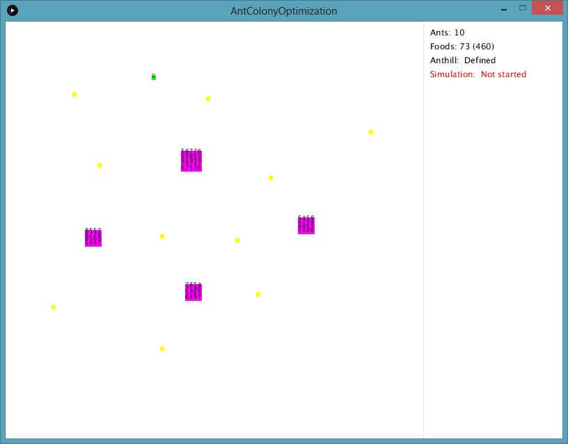 | 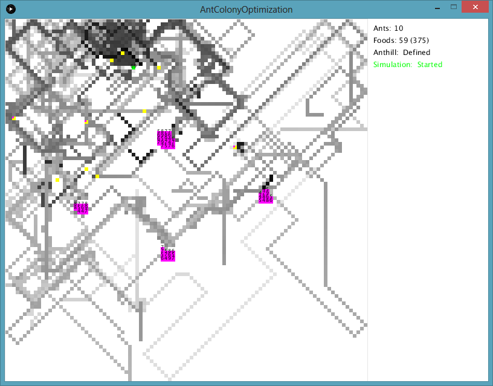 | 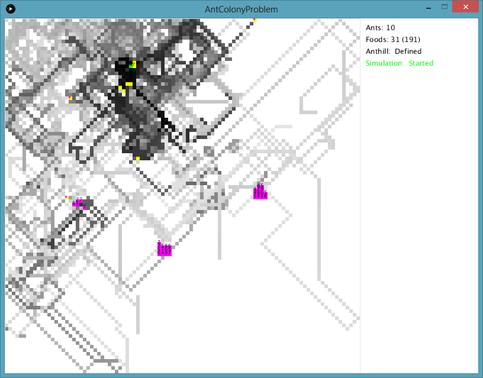 |

| aco-simulation_4.png     | aco-simulation_5.png     |
| ------------------------ | ------------------------ |
| 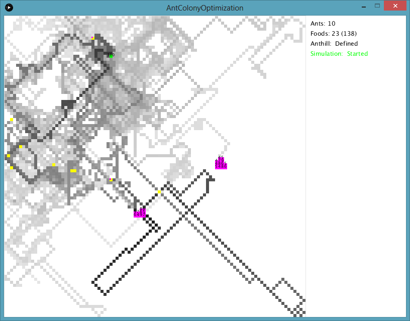 | 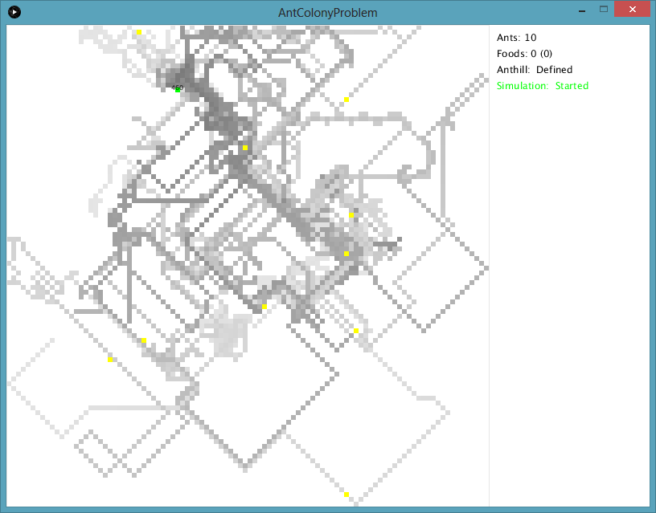 |

asdf

### > Setting anthill and food repositories but generating 50 random ants

asdf

| aco-simulation_1.png     | aco-simulation_2.png     | aco-simulation_3.png     | aco-simulation_4.png     |
| ------------------------ | ------------------------ | ------------------------ | ------------------------ |
| 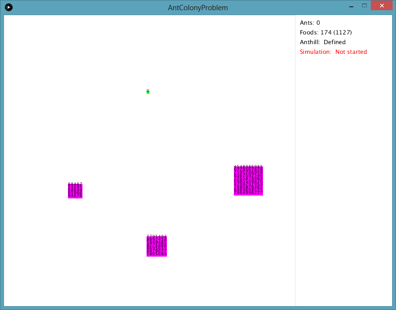 | 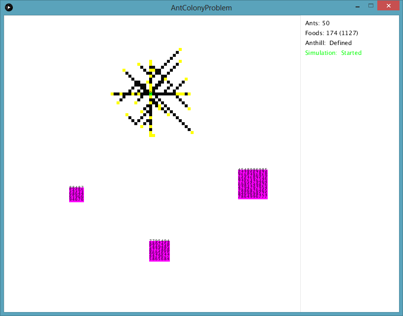 | 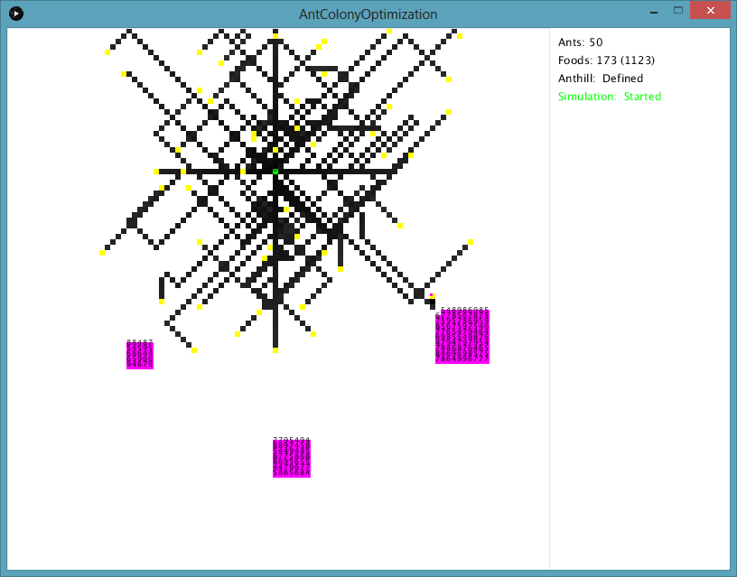 | 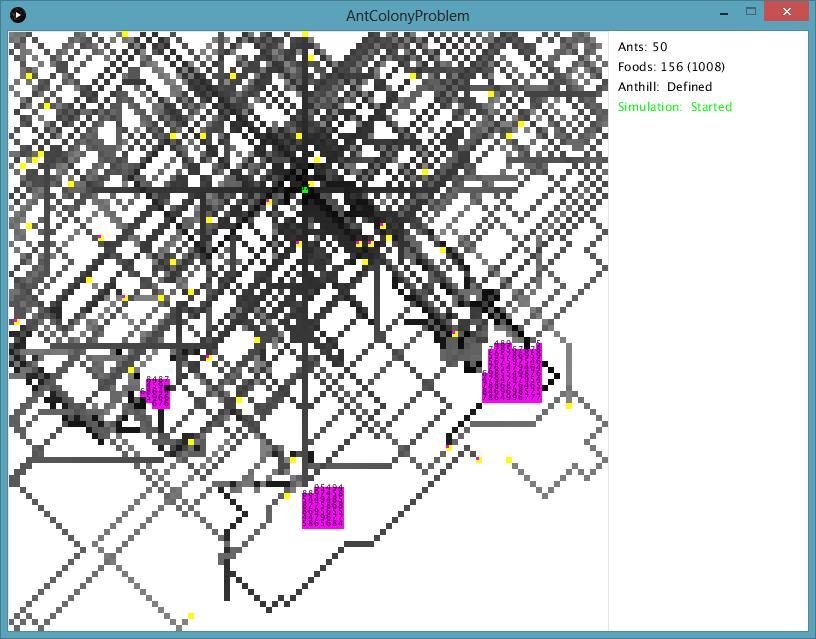 |

| aco-simulation_5.png     | aco-simulation_6.png     | aco-simulation_7.png     | aco-simulation_8.png     |
| ------------------------ | ------------------------ | ------------------------ | ------------------------ |
| 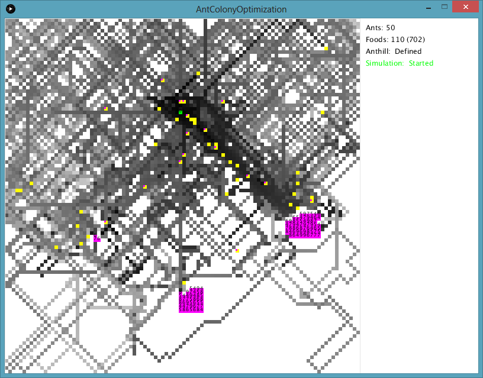 | 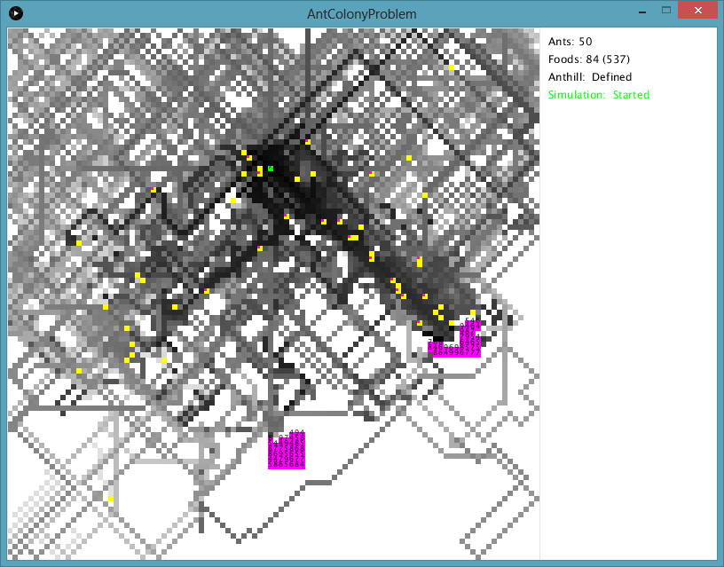 | 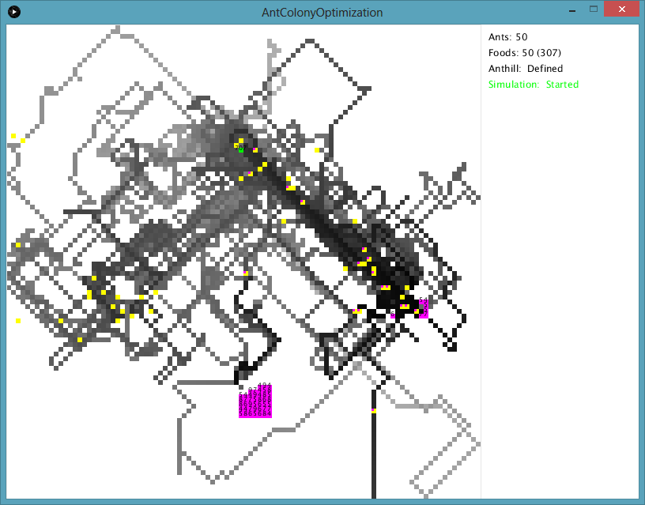 | 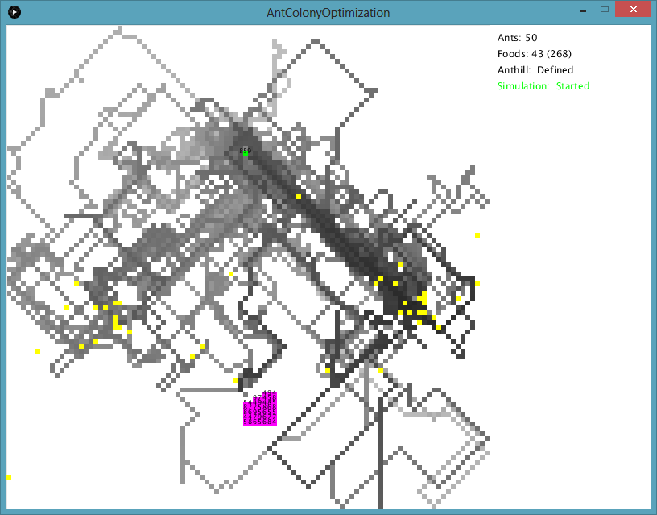 |

| aco-simulation_9.png     | aco-simulation_10.png     | aco-simulation_11.png     |
| ------------------------ | ------------------------ | ------------------------ |
| 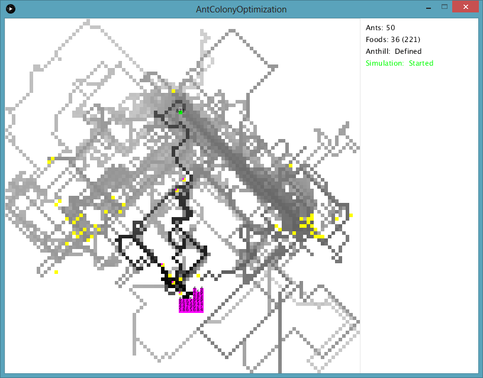 | 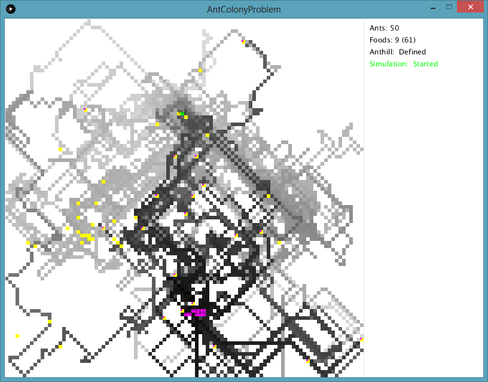 | 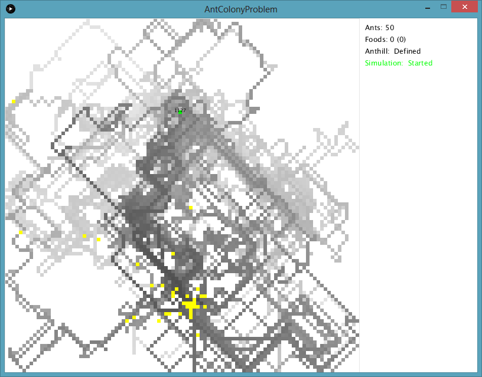 |

asdf
